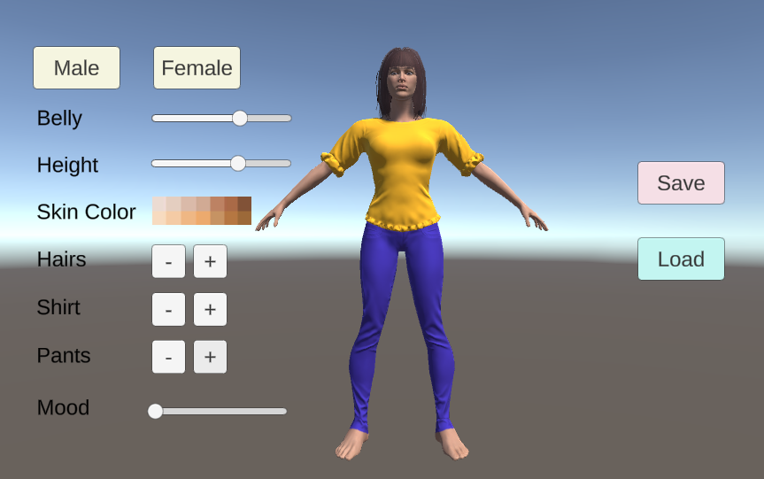

# UMACharacterCreator
**Unity Project with UMA (Unity Multipurpose Avatar) creator.**  
The users can create, save, and load a customized UMA using Unity UI elements (buttons, sliders, and so forth) on canvas. 

## Technologies
- Unity Engine
- C# 

## Features
- Customize UMA's features including height, skin tone, gender, body types, hair styles, clothes, and so forth
- Save the UMA
- Load the saved UMA  

